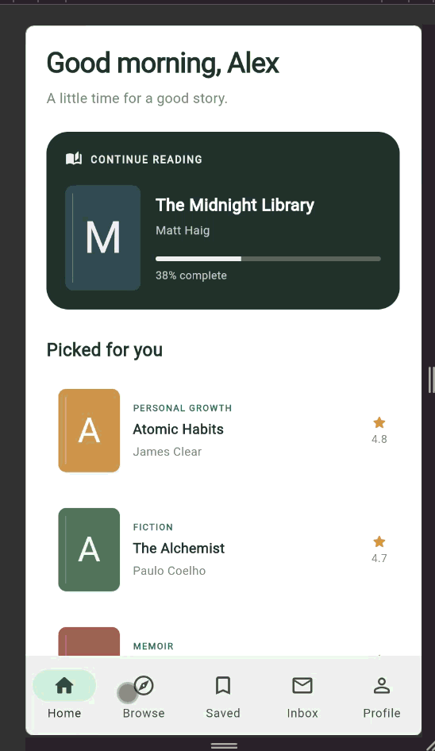

# Demo Navigation App

This demo navigation app is built as a book-themed Flutter application that shows how a modern reading app can organize content with a bottom navigation layout. It gives users a clean interface for continuing a book, browsing new titles, saving future reads, checking notifications, and viewing profile details.

## Navigation

- Home: Displays the current book progress and personalized recommendations for the reader.
- Browse: Lets users search by title or author and filter books by category to discover the next read.
- Saved: Keeps favorite or future books in a personal reading list for later.
- Inbox: Shows reading notes, recommendations, and achievements related to the user’s progress.
- Profile: Displays reading stats, goals, and personal preferences.

## How to run the app

1. Open the project folder in your terminal.
2. Run `flutter pub get` to install dependencies.
3. Run `flutter test` to test the application first.
4. Start the app with `flutter run`.
5. If you want to target a specific device, use `flutter run -d <device-id>`.
